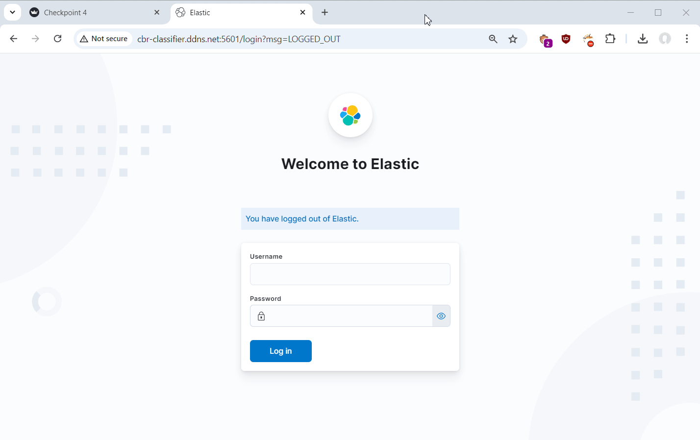

## Классификатор пресс-релизов ЦБ с предсказанием будущей ключевой ставки

### Описание проекта

ЦБ каждый раз после заседания по ключевой ставке на сайте публикует пресс-релизы, в которых рассказывается про состояние экономики, инфляцию, спрос на продукты, услуги и т.д. и объясняет причину изменения/не изменения ставки. Задача состоит в том, чтобы по семантике текста понять, что будет происходить с ключевой ставкой после на следующем заседании: ЦБ ее поднимет, опустит или оставит неизменной. Необходимо создать классификатор, который сможет определить тексты на 3 класса: -1 (ставка опустится), 0 (останется неизменной), 1 (ставку повысят).

[План работы над проектом.](checkpoint.md)

### Участники проекта

- Ковалева Александра (@ak0va, [github](https://github.com/ak0vacorp)) - куратор проекта
- Жарковский Дмитрий (@KuBaN_190, [github](https://github.com/KuBaN658))
- Иванов Иван (@ivanov_ivan_sergevich, [github](https://github.com/Ivanchenko99))
- Куимов Владислав (@etoenot, [github](https://github.com/eto-enot))
- Кузьмин Дмитрий (@kuzda, [github](https://github.com/dkzmn))
- Хадиев Руслан (@firstmodelrus, [github](https://github.com/RuslanKHAI))

### Базовая часть проекта:
1. [Парсеры](scraping) пресс-релизов, данных по ключевой ставке, уровням инфляции, курсу доллара США.
2. [Описание](dataset.md) собранных данных.
3. [Разведочный анализ данных](https://nbviewer.org/github/ai24-team-15/cbr-press-release-classifier/blob/main/eda/cbr_press_releases.ipynb) и [выводы](EDA.md).
4. **Разработка классификатора:** От простых базовых моделей TF-IDF до трансформеров. Приветствуется все!!! :) 

### Задачи ML & DL:
1. **Обучение и валидация моделей:**
- Сравнение точности различных моделей на тестовом датасете.
- Использование различных техник обучения, таких как BERT.
2. **Настройка гиперпараметров:**
- Оптимизация параметров моделей для повышения точности детекции.
- Настройка гиперпараметров на основе солидного кросс-валидационного (CV) анализа.
3. **Разработка веб-приложения / бота:**
- Создание интерфейса для демонстрации работы классификатора в реальном времени.

### Сборка и запуск проекта

Имеется три файла конфигурации для Docker Compose:
- `docker-compose.yml` - включает команды для построения образов fastapi-сервиса и streamlist-приложения.
- `docker-compose.elk.yml` - конфигурация системы сбора логов ELK. В каталоге `config` расположена конфигурация компонентов ELK. В файле `.env_elk` необходимо задать реквизиты, которые будут использоваться для доступа к ElasticSearch.
- `docker-compose.deploy.yml` - конфигурация для деплоя на Yandex Cloud. Отличается от первого варианта тем, что использует готовые образы, предварительно загруженные в реестр.

- Склонировать себе данный репозиторий
- Собрать образы docker для fastapi-сервиса и streamlist-приложения, выполнив команду `docker compose build` в каталоге проекта.
- Задать настройки приложений в файле `.env` (см. файл `.env_example` для описания параметров).
- *Опционально.* Задать настройки для системы ELK в файле `.env_elk` (см. файл `.env_elk_example` для описания параметров).
- Запустить оба приложения командой `docker compose up -d`.
- *Опционально.* Запустить систему сбора логов ELK командой `docker compose -f docker-compose.elk.yml up -d`.
- Приложение будет доступно через браузер на порту 8000, система сбора логов - 5601.

### Иллюстрация работы проекта

Подробную информацию об использовании всех функций приложения см. в [отчете](report.md).

### Иллюстрация работы системы сбора логов

