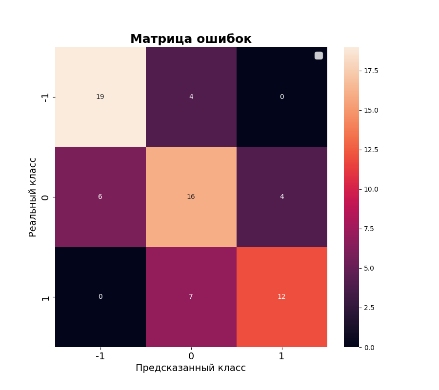
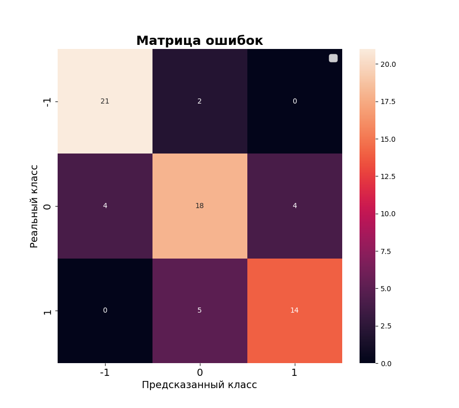
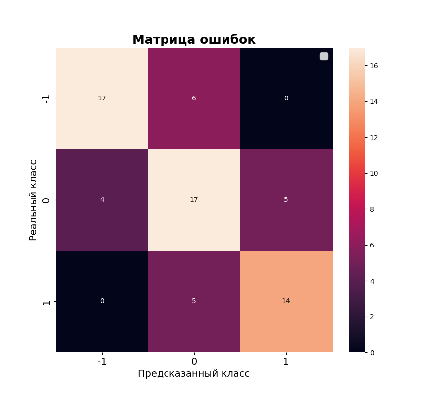
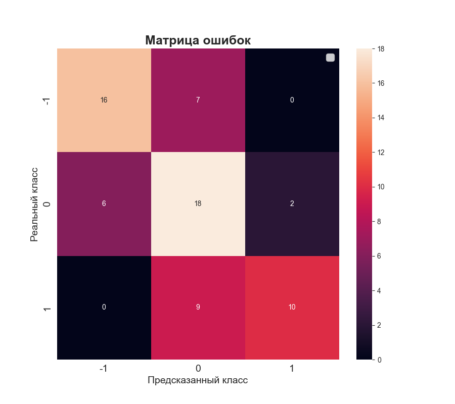
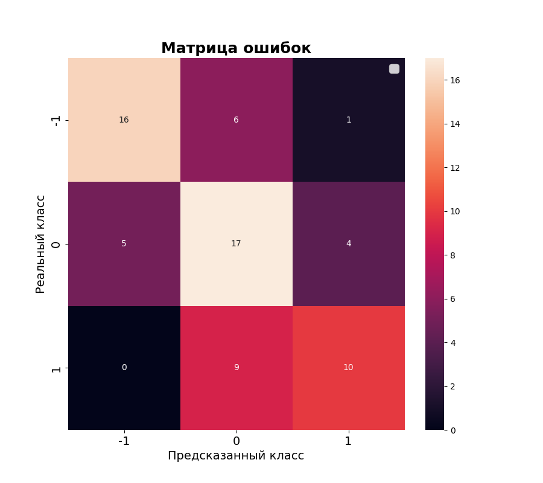
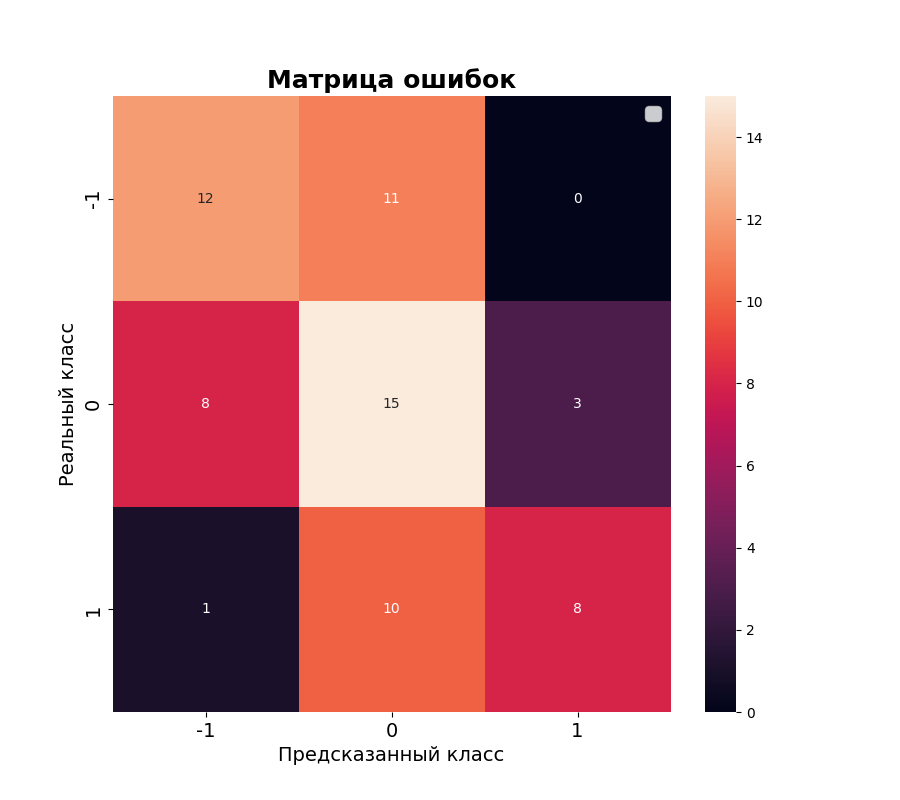
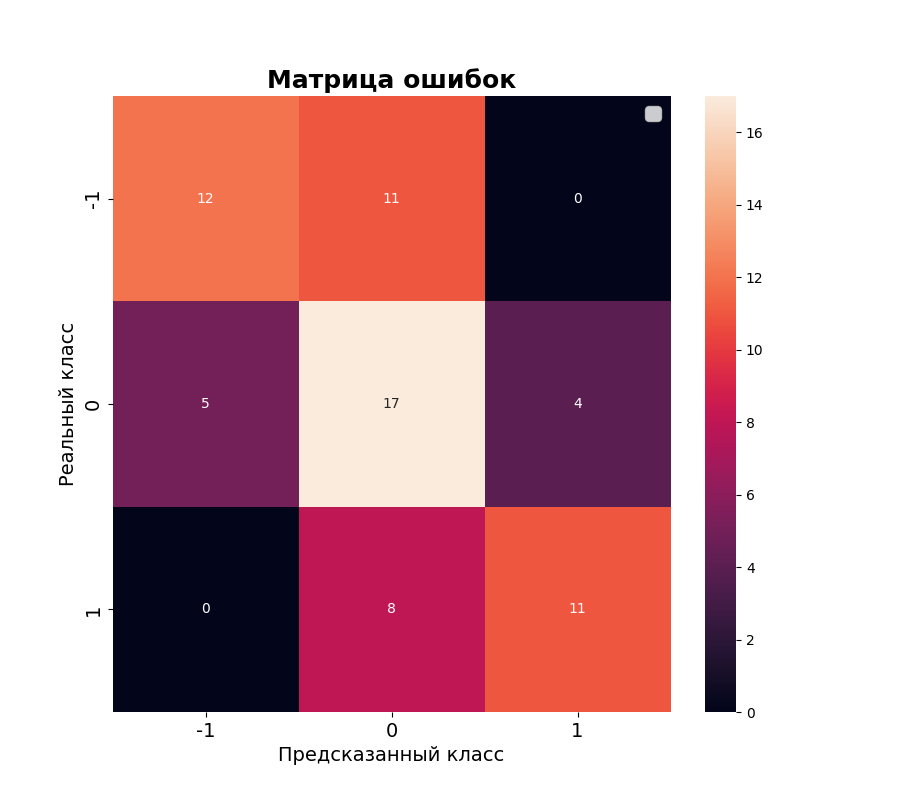
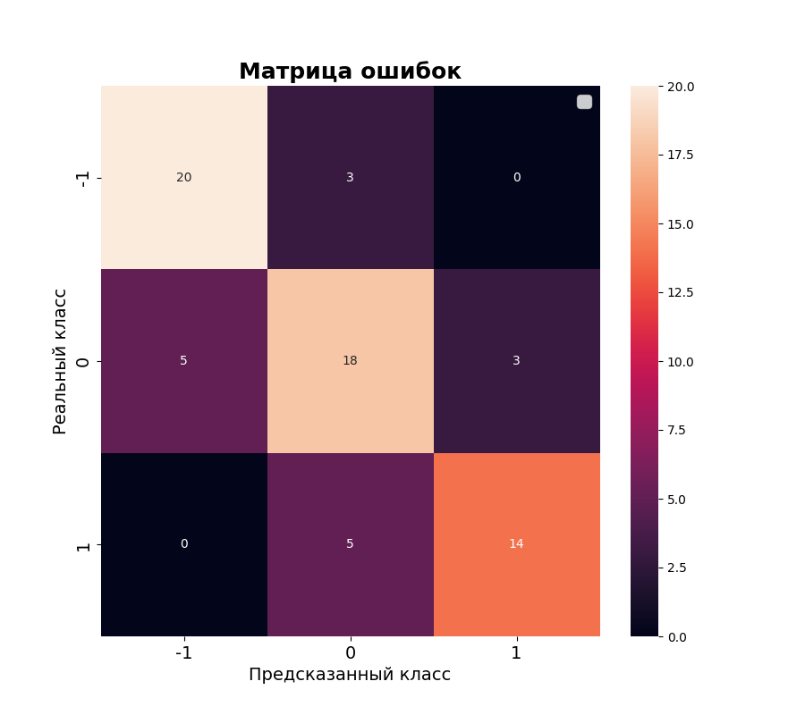
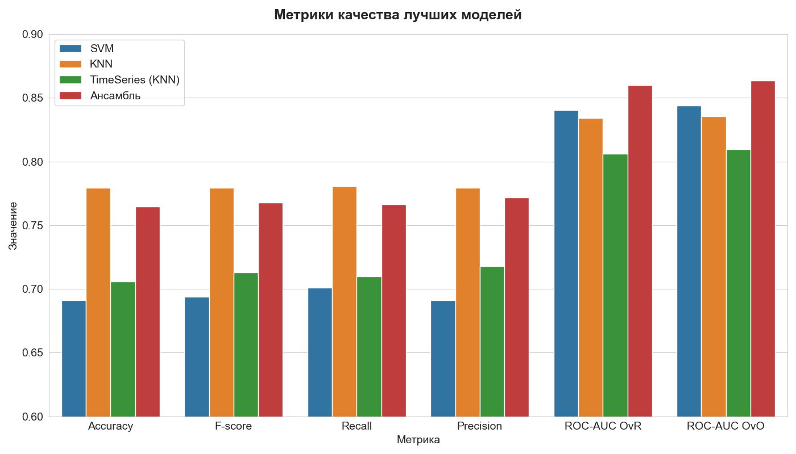

<!-- theme: default -->
<!-- paginate: true -->
<!-- lang: ru -->

# Команда 15

## Классификатор пресс-релизов ЦБ с предсказанием будущей ключевой ставки

**Куратор проекта**: Ковалева Александра

**Участники проекта**:

<table>
    <tr>
        <td>Жарковский Дмитрий</td>
        <td>Кузьмин Дмитрий</td>
    </tr>
    <tr>
        <td>Иванов Иван</td>
        <td>Хадиев Руслан</td>
    </tr>
    <tr>
        <td>Куимов Владислав</td>
        <td></td>
    </tr>
</table>

    
    <a href="https://github.com/ai24-team-15">https://github.com/ai24-team-15</a>

---

# Постановка задачи

ЦБ каждый раз после заседания по ключевой ставке на сайте публикует пресс-релизы, в которых рассказывается про состояние экономики, инфляцию, спрос на продукты, услуги и т.д. и объясняет причину изменения/не изменения ставки.

Задача состоит в том, чтобы по семантике текста понять, что будет происходить с ключевой ставкой после на следующем заседании: ЦБ ее поднимет, опустит или оставит неизменной. Необходимо создать классификатор, который сможет определить тексты на 3 класса: -1 (ставка опустится), 0 (останется неизменной), 1 (ставку повысят).

---

# Лучшая линейная модель

На предыдущих этапах был построен следующий пайплайн на основе линейной модели, показавший наилучший результат:
- TF-IDF векторизация текстов пресс-релизов
- Отбор признаков при помощи логистической регрессии с L1-регуляризацией
- SVM-классификатор

---

# Лучшая линейная модель: метрики качества

| Метрика     | Значение |
|-------------|----------|
| Accuracy    | 0.691176 |
| F1-score    | 0.693718 |
| Recall      | 0.700864 |
| Precision   | 0.691017 |
| ROC-AUC OvR | 0.840529 |
| ROC-AUC OvO | 0.844115 |

    

Метод опорных векторов показал достаточно хорошее качество, едва удалось побить эти метрики с помощью нелинейных моделей.

---

# Нелинейные модели: KNN

Лучший пайплайн на основе классификатора KNN включает в себя:
- TF-IDF векторизация текстов пресс-релизов
- Отбор признаков при помощи логистической регрессии с L1-регуляризацией
- KNN-классификатор

---

# KNN: метрики качества

| Метрика     | Значение |
|-------------|----------|
| Accuracy    | 0.779412 |
| F1-score    | 0.779213 |
| Recall      | 0.780731 | 
| Precision   | 0.779259 |
| ROC-AUC OvR | 0.834168 |
| ROC-AUC OvO | 0.835548 |

    

По метрикам ROC-AUC качество несколько уменьшилось относительно линейной модели, но по другим метрикам результат улучшился.

---

# Нелинейные модели: TimeSeries (KNN)

Модель использующая подходы временных рядов, тексты пресс-релизов в данной модели не используются.

Пайплайн этой модели включает в себя:
- Генерацию 4 лаговых признаков целевой переменной
- Герерацию 3 лаговых признаков, курса доллара, инфляции и величины процентной ставки
- Генерацию относительного прироста для каждого признака из предыдущего пункта
- Масштабирование признаков
- KNN-классификатор

---

# TimeSeries: метрики качества

| Метрика     | Значение |
|-------------|----------|
| Accuracy    | 0.705882 |
| F1-score    | 0.713066 |
| Recall      | 0.709940 | 
| Precision   | 0.717836 |
| ROC-AUC OvR | 0.806009 |
| ROC-AUC OvO | 0.809599 |

    

Модель одинаково хорошо детектирует все виды классов, и не разу не перепутала повышение ставки с понижением.

---

# Нелинейные модели: RandomForest

Пайплайн для модели RandomForest включает в себя:
- TF-IDF векторизация текстов пресс-релизов
- Отбор признаков при помощи PCA
- RandomForest-классификатор

---

# RandomForest: метрики качества

| Метрика     | Значение |
|-------------|----------|
| Accuracy    | 0.632353 |
| F1-score    | 0.631884 |
| Recall      | 0.620548 | 
| Precision   | 0.681082 |
| ROC-AUC OvR | 0.817684 |
| ROC-AUC OvO | 0.822178 |

    

Случайный лес показал качество хуже более простых алгоритмов, возможно он требует больше данных для обучения.

---

# Нелинейные модели: XGBoost

Пайплайн для модели XGBoost включает в себя:
- TF-IDF векторизация текстов пресс-релизов
- XGBoost-классификатор

---

# XGBoost: метрики качества

| Метрика     | Значение |
|-------------|----------|
| Accuracy    | 0.632353 |
| F1-score    | 0.633905 |
| Recall      | 0.625271 | 
| Precision   | 0.653274 |
| ROC-AUC OvR | 0.766337 |
| ROC-AUC OvO | 0.771152 |

    

XGBoost показал accuracy лучше других бустингов, но хуже более простых алгоритмов.

---

# Нелинейные модели: Catboost

Пайплайн для модели Catboost включает в себя:
- TF-IDF векторизация текстов пресс-релизов
- Catboost-классификатор

---

# Catboost: метрики качества

| Метрика     | Значение |
|-------------|----------|
| Accuracy    | 0.514706 |
| F1-score    | 0.520886 |
| Recall      | 0.506572 | 
| Precision   | 0.571789 |
| ROC-AUC OvR | 0.701963 |
| ROC-AUC OvO | 0.709235 |

    

Catboost показал качество хуже другх бустингов.

---

# Нелинейные модели: LigthGBM

Пайплайн для модели LigthGBM включает в себя:
- TF-IDF векторизация текстов пресс-релизов
- LigthGBM-классификатор

---

# LigthGBM: метрики качества

| Метрика     | Значение |
|-------------|----------|
| Accuracy    | 0.588235 |
| F1-score    | 0.598482 |
| Recall      | 0.584844 | 
| Precision   | 0.637146 |
| ROC-AUC OvR | 0.789938 |
| ROC-AUC OvO | 0.796427 |

    

LigthGBM показал качество ROC-AUC лучше, чем другие бустинги, но хуже более простых алгоритмов.

---

# Ансамбль из лучших моделей

В ансамбль методом обычного голосования мы включили следующие модели:
- SVC
- KNN
- TimeSeries (KNN)

---

# Ансамбль: метрики качества

| Метрика     | Значение |
|-------------|----------|
| Accuracy    | 0.764706 |
| F1-score    | 0.767806 |
| Recall      | 0.766238 | 
| Precision   | 0.771946 |
| ROC-AUC OvR | 0.860113 |
| ROC-AUC OvO | 0.863595 |

    

Ансамбль показывает самую высокую метрику ROC-AUC-OvO среди всех моделей классического ML, которые мы поробовали.

---

# Метрики качества

    

Ансамбль превзошел по интегральным метрикам качества остальные модели, хотя его остальные метрики немного ниже чем у KNN.

---

# Выводы

- При подборе лучших моделей для ансамбля, заметили, что стоит смотреть не только на ROC-AUC-OvO, но также и на Accuracy.
- Методы ансамблирования моделей, такие как бустинг и случайный лес, окзались хуже более простых моделей, да и качество линейных алгоритмов с трудом удалось перебить. Виной этому небольшая выборка и значительное количество признаков - на порядок больше размера выборки.
- В связи с этим, методы PCA и отбор признаков с помощью L1-регуляризации оказали положительное влияние на качество моделей.
- Word2Vec и GloVe с нелинейными моделями показали плохой результат, как и в случае линейных, поскольку среднее от векторов слов плохо отражает смысл всего текста.