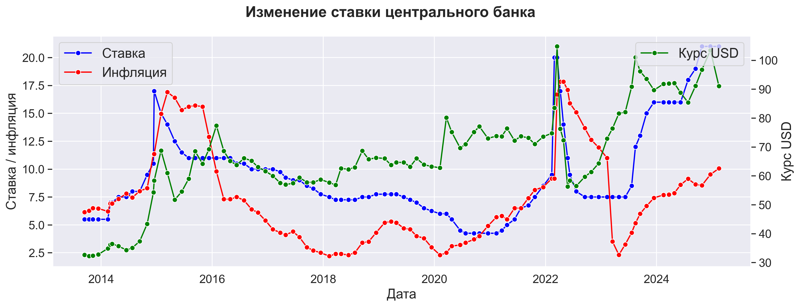
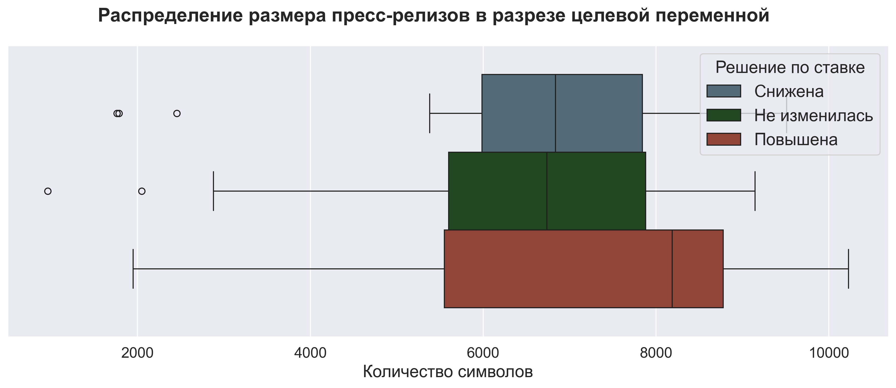
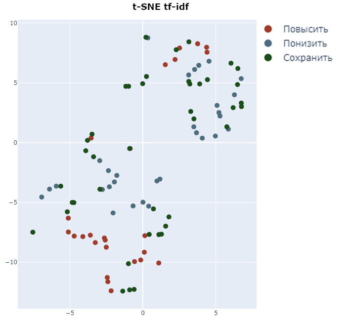
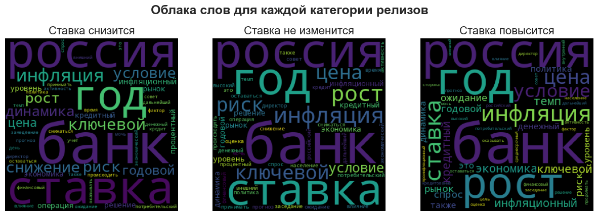
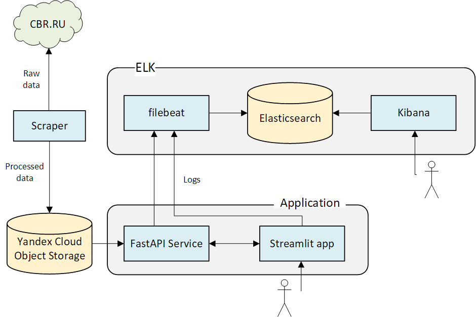

# Команда 15

## Классификатор пресс-релизов ЦБ с предсказанием будущей ключевой ставки

  <table>
    <tr><h4>Куратор проекта:</h4></tr>
      <tr><td>Ковалева Александра</td></tr>
  </table>

  

  <table>
    <tr><h4>Участники проекта:</h4></tr>
    <tr>
      <td>Жарковский Дмитрий</td> 
    </tr>
    <tr> 
      <td>Кузьмин Дмитрий</td>
    </tr>
    <tr>
      <td>Куимов Владислав</td> 
    </tr>
      <td>Хадиев Руслан</td>
    </tr>
  </table>

  
  <a href="https://github.com/ai24-team-15">https://github.com/ai24-team-15</a>

---

<h1>Постановка задачи</h1>

  <h4>Контекст задачи:</h4>
  

    После каждого заседания совета директоров по ключевой ставке Центральный Банк публикует пресс-релизы
  

  <h4>Суть проблемы:</h4>
  

    Текст пресс-релиза содержит косвенные сигналы о будущих решениях ЦБ, которые необходимо выявить, формализовать и автоматизировать
  

  <h4>Решение:</h4>
  

    Создать классификатор текстов, прогнозирующий решение о ключевой ставке на основе семантического анализа
  

---

<h1>Описание данных</h1>

<h4>Собранный датасет имеет следующие признаки:</h4>

- `date` - дата опубликования пресс-релиза;
- `link` - ссылка на пресс-релиз;
- `title` - заголовок пресс-релиза;
- `release` - текст пресс-релиза;
- `rate` - ключевая ставка утвержденная во время следующего заседания;
- `inflation` - значение инфляции в месяц следующего заседания (годовая);
- `usd` - курс доллара на день следующего заседания;

---

<h1>Особенности данных</h1>
<h4>Мало данных:</h4>

  Датасет около 100 наблюдений. Имеет место проблема переобучения.

<h4>Корреляция:</h4>

  Наблюдается корреляция между ключевой ставкой, инфляцией и курсом доллара.

<h4>Дисбаланс классов:</h4>

Наблюдается небольшой дисбаланс по классам:
<ul>
    <li> 43,2% наблюдений - сохранение ставки</li>
    <li>31,6% - понижение ставки</li>
    <li>25,3% - повышение ставки</li>
</ul>

---

<h1>Исследовательский анализ</h1>

---

<h1>Динамика ключевой ставки</h1>

  
  

  💡 Ставку повышают при высокой инфляции 
  💡 Мы видим три цикла роста ставки, сейчас мы находимся на пике третьего цикла 
  💡 С долларом корреляция значительно слабее, в период с 2018 года по 2021 ставка снижается, а доллар растет

---

<h1>Длина пресс-релизов</h1>

💡 За длинными пресс-релизами как правило следует повышение ключевой ставки. Возможно, руководство банка пытается оправдать свое решение.

---

<h1>Визуализация на плоскости</h1>

    

        
    

    

      💡 T-SNE визуализация разбила тексты пресс-релизов на 2 кластера. Возможно в 2018 году сменился редактор и тексты сильно поменялись.
    

---

<h1>Частота слов</h1>

    

  💡 Частота слов не сильно меняется от класса к классу, но все же слово инфляция реже встречается перед снижением ставки 
  💡 Частотность слов в пресс-релизах очень сильно отличается от стандартной частотности русского языка

---

<h1>Метрика качества</h1>

<h4>Метрикой качества выбрана <b>ROC AUC OvO</b></h4>

  ✅  Она является интегральной (не зависит от порога перевода вероятностей в классы)

 
 ✅ Не чувствительна к дисбалансу классов (в нашем датасете наблюдается небольшой дисбаланс).

---

<h1>Классический Machine Learning</h1>

---

<h1>Используемые подходы</h1>

    

        

            <h3 class="approach-title">Векторизация текстов</h3>
            <ul class="approach-list">
                <li>Bag-of-Words (BoW)</li>
                <li>Tf-Idf</li>
                <li>N-граммы</li>
                <li>Word2Vec</li>
                <li>GloVe</li>
            </ul>
        

  

            <h3 class="approach-title">Классификаторы</h3>
            <ul class="approach-list">
                <li>Логистическая регрессия</li>
                <li>SVM</li>
                <li>Naive Bayes</li>
                <li>KNN</li>
                <li>Random Forest</li>
                <li>Бустинговые методы</li>
            </ul>
        

  

            <h3 class="approach-title">Отбор признаков</h3>
            <ul class="approach-list">
                <li>From model</li>
                <li>PCA</li>
            </ul>
        

    

---

<h1>Результаты линейных моделей</h1>

|model|accuracy|f1|precision|recall|roc_auc_ovr|roc_auc_ovo|
|-----|--------|--|---------|------|-----------|-----------|
|min_baseline|0.660000|0.663508|0.665185|0.662014|0.741088|0.746510|
|bow l1 only release|0.619718|0.625363|0.638134|0.617586|0.769287|0.776198|
|bow elasticnet|0.605634|0.614252|0.627717|0.605681|0.782629|0.789369|
|bow release title|0.535211|0.540659|0.559180|0.530911|0.781719|0.787411|
|bow release all num|0.605634|0.608153|0.622475|0.600042|0.781633|0.786863|
|bow svc only release|0.661972|0.669910|0.690243|0.658939|0.777454|0.782790|
|tf_idf l1 only release|0.633803|0.636658|0.643844|0.633459|0.787036|0.793533|
|tf_idf only release best word|0.690141|0.687276|0.716378|0.677423|0.812873|0.818740|
|tf_idf title release|0.704225|0.704690|0.727814|0.694967|0.814459|0.819993|
|tf_idf numerical release|0.633803|0.636130|0.690598|0.619883|0.779646|0.783247|
|**tf-idf svc only release**|**0.704225**|**0.703578**|**0.722616**|**0.696951**|**0.838408**|**0.842157**|
|MultinomialNB|0.591549|0.588805|0.581790|0.611007|0.758716|0.769045|
|word2vec|0.549296|0.551954|0.546667|0.563701|0.734578|0.741607|
|word2vec_pretrained|0.591549|0.606333|0.623737|0.595447|0.752430|0.761109|
|word2vec_pretrained svc|0.563380|0.573269|0.584057|0.565998|0.700435|0.709900|
|glove svc only release|0.647887|0.654106|0.665218|0.647034|0.759503|0.766930|

---

<h1>Результаты нелинейных моделей</h1>

|model|accuracy|f1|precision|recall|roc_auc_ovr|roc_auc_ovo|
|-----|--------|--|---------|------|-----------|-----------|
|**K-neighbors tf_idf**|**0.704225**|**0.708239**|**0.708229**|**0.711692**|**0.819984**|**0.823556**|
|K-neighbors tf_idf pca|0.676056|0.687194|0.684106|0.690773|0.801532|0.806358|
|K-neighbors word2vec|0.647887|0.629487|0.628759|0.739583|0.773496|0.776707|
|K-neighbors weighted word2vec|0.647887|0.629487|0.628759|0.739583|0.788023|0.789826|
|lag target Random Forest|0.521127|0.526519|0.531642|0.544029|0.731007|0.738598|
|lag target, rate Random Forest|0.605634|0.618363|0.605368|0.644444|0.731230|0.739525|
|lag target, rate, usd Random Forest|0.577465|0.582126|0.569967|0.632840|0.752053|0.759921|
|lag target, rate, usd, inflation Random Forest|0.661972|0.670210|0.660610|0.700436|0.748025|0.753910|
|lag target, rate, usd, inflation, growth RF|0.676056|0.686532|0.674499|0.711310|0.759706|0.765801|
|TimeSeries way Random Forest|0.605634|0.606619|0.595760|0.659621|0.770320|0.777869|
|TimeSeries way KNN|0.704225|0.712155|0.707916|0.719756|0.801623|0.805869|
|TimeSeries way CatBoost|0.661972|0.668035|0.666562|0.669849|0.774106|0.780636|
|**ensemble**|**0.718310**|**0.722157**|**0.725773**|**0.719973**|**0.843613**|**0.848763**|
|TF-IDF XGBoost|0.632353|0.633905|0.625271|0.653274|0.766337|0.771152|
|TF-IDF CatBoost|0.514706|0.520886|0.506572|0.571789|0.701963|0.709235|
|TF-IDF LigthGBM|0.588235|0.598482|0.584844|0.637146|0.789938|0.796427|

---

<h1>Лучшие результаты классических моделей</h1>

    

        
    

    

      💡 По всем метрикам ансамбль впереди одиночных моделей. 
       
      💡 Линейная модель отстает совсем немного
    

---

<h1>Deep Learning</h1>

---

# Используемые подходы

    

        

            <h3 class="approach-title">Архитектуры</h3>
            <ul class="approach-list">
                <li>CNN</li>
                <li>LSTM</li>
                <li>Полносвязные сети</li>
                <li>Трансформеры</li>
                <li>Word2Vec</li>
            </ul>
        

  

            <h3 class="approach-title">Подходы</h3>
            <ul class="approach-list">
                <li>Head - классическая модель</li>
                <li>Head - полносвязный слой</li>
                <li>Аугментация</li>
                <li>Transfer Learning</li>
                <li>Разбитие текстов на Чанки</li>
            </ul>
        

    

---

<h1>Результаты Deep Learning</h1>

|model|accuracy|f1|precision|recall|roc_auc_ovr|roc_auc_ovo|
|-----|--------|--|---------|------|-----------|-----------|
|MLP TF-IDF|0.633803|0.637242|0.639098|0.635712|0.734932|0.739688|
|MLP TF-IDF + feature selection|0.619718|0.621444|0.619570|0.623723|0.712337|0.714390|
|MLP TF-IDF aug|0.690141|0.695377|0.697995|0.693210|0.757692|0.763497|
|CNN Word2Vec|0.507042|0.512979|0.503133|0.533333|0.680951|0.688055|
|CNN Word2Vec pretrained|0.591549|0.601595|0.595447|0.610236|0.720667|0.727548|
|CNN Glove pretrained|0.619718|0.627079|0.621241|0.635481|0.741688|0.746841|
|CNN OHE|0.591549|0.597485|0.588137|0.618095|0.743447|0.749465|
|CNN tf-idf|0.661972|0.669367|0.672201|0.666975|0.743708|0.749517|
|LSTM|0.535211|0.547708|0.534566|0.573560|0.668927|0.678010|
|MLP TF-IDF aug|0.690141|0.695377|0.697995|0.693210|0.757692|0.763497|
|**Sentence transformer**|**0.661972**|**0.672887**|**0.668233**|**0.683114**|**0.815232**|**0.823791**|
|Sentence transformer (chunk)|0.507042|0.495042|0.489557|0.560847|0.711372|0.717895|

---

<h1>Лучшие результаты Deep Learning</h1>

    

        
    

    

      💡 По метрикам ROC-AUC Sentence Transformer впереди 
       
  

---

<h1>Сервис</h1>

---

<!-- ---

# Сервис FastAPI

Реализован сервис на FastAPI для управления моделями и данными.

**Данные:** Загрузка данных с помощью post-запроса или с S3 сервера. При остановке сервиса данные сохраняются и загружаются при последующем запуске.

**Обучение моделей:** Обучение производится с заданными в запросе гиперпараметрами, в отдельном процессе. Реализованы две модели, показавшие лучшие результаты на предыдущем чекпоинте.

**Инференс моделей:** Реализован как обычный прогноз, так и вычисление метрик при обучении на части данных.

**Управление моделями:** Как и данные, модели сохраняются во время остановки сервиса и загружаются при запуске. -->

<!-- ---

# Приложение Streamlit

Реализован многостраничный пользовательский-интерфейс для взаимодействия с сервисом.

**Загрузка данных:** Загрузка своих данных, либо выбрать актуальные данные.

**Исследовательский анализ:** Баланс классов, динамика ставки, курса доллара США и годовой инфляции, длина текстов, облака слов, t-SNE визуализация.

**Машинное обучение:** Обучение моделей с выбором гиперпараметров, сравнение моделей между собой и предсказание с помощью выбранной модели. -->

<h1>Демонстрация работы сервиса</h1>

---

<h1>Инфраструктура</h1>

---

# Распределение работы в команде

    

        

            <h3 class="approach-title">Жарковский Дмитрий</h3>
            <ul class="approach-list">
                <li>Скрапер (предобработка данных, загрузка в S3)</li>
                <li>EDA</li>
                <li>Линейные модели, Random Forest (с Bow, Tf-Idf и Word2Vec)</li>
                <li>RNN, LSTM, трансформеры</li>
                <li>Ансамблирование моделей</li>
                <li>Приложение Streamlit</li>
            </ul>
        

  

            <h3 class="approach-title">Кузьмин Дмитрий</h3>
            <ul class="approach-list">
                <li>Скрапер (предобработка данных, данные по инфляции, курс доллара)</li>
                <li>Модели с бустингом</li>
                <li>Сервис FastAPI</li>
                <li>Эксперименты с аугментацией текстов</li>
            </ul>
        

    

---

# Распределение работы в команде

    

        

            <h3 class="approach-title">Куимов Владислав</h3>
            <ul class="approach-list">
                <li>Скрапер (парсинг пресс-резилов)</li>
                <li>Немного EDA (t-SNE)</li>
                <li>Модели с GloVe</li>
                <li>KNN</li>
                <li>MLP, CNN</li>
                <li>Инфраструктура (Docker, ELK, деплой в Yandex Cloud)</li>
            </ul>
        

  

            <h3 class="approach-title">Хадиев Руслан</h3>
            <ul class="approach-list">
                <li>Улучшения в некоторых моделях</li>
                <li>транформер с различными агрегациями</li>
                <li>линейная модель</li>
                <li>наполенение приложение Streamlit</li>
                <li>Подготовка выводов по моделям и
 результатам реализации проекта</li>
            </ul>
        

    

---

<h1>Итоги</h1>

  

    <h4>✅ Получилось:</h4>
    

      Собран исходный датасет и проведен подробный исследовательский анализ. 
      Получено высокое качество с помощью классических ML моделей. 
      Реализован сервис и веб-приложение.
    

    
  <h4>Причины удач:</h4>
    

      Дружная команда  
      Четкое распределение обязанностей  
      Отсутствие "долгов".
    

  

  

    <h4>❌ Не получилось:</h4>
    

      Улучшить качество с помощью DL моделей.
    

  <h4>Причины неудач:</h4>
    

      Мало данных для обучения глубоких нейронных сетей.
    

  

