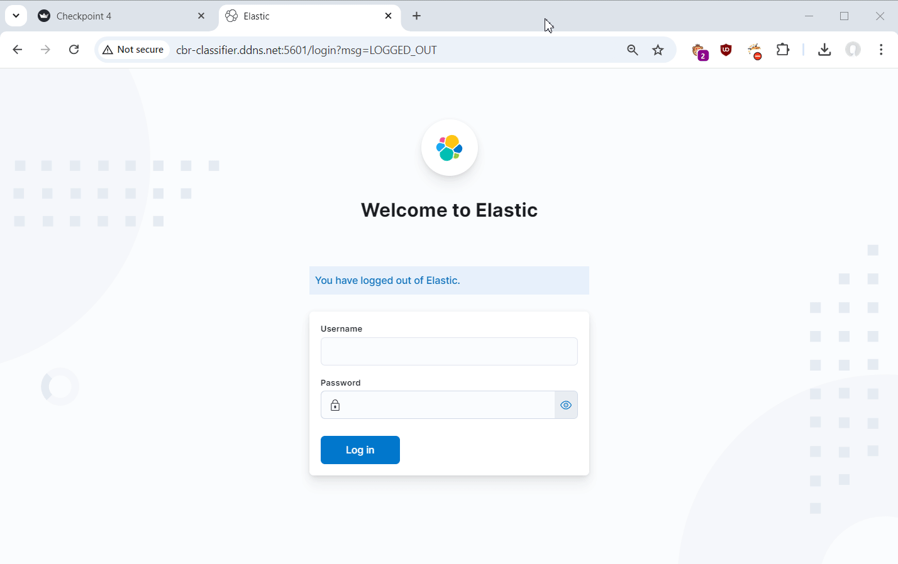

# Команда 15

## Классификатор пресс-релизов ЦБ с предсказанием будущей ключевой ставки

  <table>
    <tr><h4>Куратор проекта:</h4></tr>
      <tr><td>Ковалева Александра</td></tr>
  </table>

  

  <table>
    <tr><h4>Участники проекта:</h4></tr>
    <tr>
      <td>Жарковский Дмитрий</td> 
    </tr>
    <tr> 
      <td>Кузьмин Дмитрий</td>
    </tr>
    <tr>
      <td>Куимов Владислав</td> 
    </tr>
      <td>Хадиев Руслан</td>
    </tr>
  </table>

  
  <a href="https://github.com/ai24-team-15">https://github.com/ai24-team-15</a>

---

<h1>Постановка задачи</h1>

  <h4>Контекст задачи:</h4>
  

    После каждого заседания совета директоров по ключевой ставке Центральный Банк публикует пресс-релизы
  

  <h4>Суть проблемы:</h4>
  

    Текст пресс-релиза содержит косвенные сигналы о будущих решениях ЦБ, которые необходимо выявить, формализовать и автоматизировать
  

  <h4>Решение:</h4>
  

    Создать классификатор текстов, прогнозирующий решение о ключевой ставке на основе семантического анализа
  

---

<h1>Описание данных</h1>

<h4>Собранный датасет имеет следующие признаки:</h4>

- `date` - дата опубликования пресс-релиза;
- `link` - ссылка на пресс-релиз;
- `title` - заголовок пресс-релиза;
- `release` - текст пресс-релиза;
- `rate` - ключевая ставка утвержденная во время следующего заседания;
- `inflation` - значение инфляции в месяц следующего заседания (годовая);
- `usd` - курс доллара на день следующего заседания;

---

<h1>Особенности данных</h1>
<h4>Мало данных:</h4>

  Датасет менее 100 наблюдений. Имеет место проблема переобучения.

<h4>Корреляция:</h4>

  Наблюдается корреляция между ключевой ставкой, инфляцией и курсом доллара.

<h4>Дисбаланс классов:</h4>

Наблюдается небольшой дисбаланс по классам:
<ul>
    <li> 43,2% наблюдений - сохранение ставки</li>
    <li>31,6% - понижение ставки</li>
    <li>25,3% - повышение ставки</li>
</ul>

---

<h1>Исследовательский анализ</h1>

---

<h1>Динамика ключевой ставки</h1>

  
  

  💡 Ставку повышают при высокой инфляции 
  💡 Мы видим три цикла роста ставки, сейчас мы находимся на пике третьего цикла 
  💡 С долларом корреляция значительно слабее, в период с 2018 года по 2021 ставка снижается, а доллар растет

---

<h1>Длина пресс-релизов</h1>

💡 За длинными пресс-релизами как правило следует повышение ключевой ставки. Возможно, руководство банка пытается оправдать свое решение.

---

<h1>Визуализация на плоскости</h1>

    

        
    

    

      💡 T-SNE визуализация разбила тексты пресс-релизов на 2 кластера. Возможно в 2018 году сменился редактор и тексты сильно поменялись.
    

---

<h1>Частота слов</h1>

    

  💡 Частота слов не сильно меняется от класса к классу, но все же слово инфляция реже встречается перед снижением ставки 
  💡 Частотность слов в пресс-релизах очень сильно отличается от стандартной частотности русского языка

---

<h1>Метрика качества</h1>

<h4>Метрикой качества выбрана <b>ROC AUC OvO</b></h4>

  ✅  Она является интегральной (не зависит от порога перевода вероятностей в классы)

 
 ✅ Не чувствительна к дисбалансу классов (в нашем датасете наблюдается небольшой дисбаланс).

---

<h1>Классический Machine Learning</h1>

---

<h1>Используемые подходы</h1>

    

        

            <h3 class="approach-title">Векторизация текстов</h3>
            <ul class="approach-list">
                <li>Bag-of-Words (BoW)</li>
                <li>Tf-Idf</li>
                <li>N-граммы</li>
                <li>Word2Vec</li>
                <li>GloVe</li>
            </ul>
        

  

            <h3 class="approach-title">Классификаторы</h3>
            <ul class="approach-list">
                <li>Логистическая регрессия</li>
                <li>SVM</li>
                <li>Naive Bayes</li>
                <li>KNN</li>
                <li>Random Forest</li>
                <li>Бустинговые методы</li>
            </ul>
        

  

            <h3 class="approach-title">Отбор признаков</h3>
            <ul class="approach-list">
                <li>From model</li>
                <li>PCA</li>
            </ul>
        

    

---

<h1>Результаты классического ML</h1>
to do

---

<h1>Deep Learning</h1>

---

<h1>Используемые подходы</h1>
to do

---

<h1>Результаты DL</h1>
to do

---

<h1>Сервис</h1>

---

<!-- ---

# Сервис FastAPI

Реализован сервис на FastAPI для управления моделями и данными.

**Данные:** Загрузка данных с помощью post-запроса или с S3 сервера. При остановке сервиса данные сохраняются и загружаются при последующем запуске.

**Обучение моделей:** Обучение производится с заданными в запросе гиперпараметрами, в отдельном процессе. Реализованы две модели, показавшие лучшие результаты на предыдущем чекпоинте.

**Инференс моделей:** Реализован как обычный прогноз, так и вычисление метрик при обучении на части данных.

**Управление моделями:** Как и данные, модели сохраняются во время остановки сервиса и загружаются при запуске. -->

<!-- ---

# Приложение Streamlit

Реализован многостраничный пользовательский-интерфейс для взаимодействия с сервисом.

**Загрузка данных:** Загрузка своих данных, либо выбрать актуальные данные.

**Исследовательский анализ:** Баланс классов, динамика ставки, курса доллара США и годовой инфляции, длина текстов, облака слов, t-SNE визуализация.

**Машинное обучение:** Обучение моделей с выбором гиперпараметров, сравнение моделей между собой и предсказание с помощью выбранной модели. -->

<h1>Демонстрация работы сервиса</h1>

---

<h1>Инфраструктура</h1>

    

        

            <h3 class="approach-title">Инструменты</h3>
            <ul class="approach-list">
                <li>Docker образы сервиса и веб-приложения</li>
                <li>Конфигурация Docker Compose для запуска приложения</li>
                <li>Система сбора логов ELK</li>
            </ul>
        

  

            <h3 class="approach-title">Сервисы Yandex Cloud</h3>
            <ul class="approach-list">
                <li>Object Storage</li>
                <li>Container Registry</li>
                <li>Compute Cloud</li>
            </ul>
        

    

---

<h1>Демонстрация системы сбора логов</h1>

---

# Распределение работы в команде

- **Куимов Владислав**: часть скрапера, немного EDA (t-SNE), некоторые модели (c GloVe), инфраструктура (Docker, ELK, деплой в Yandex Cloud)
- **Жарковский Дмитрий**: часть скрапера, часть исследователького анализа, модели с Bow, Tf-Idf и Word2Vec, Streamlit в последнем чекпоинте.
- **Кузьмин Дмитрий**: часть скрапера, сервис FastAPI.
- **Хадиев Руслан**: участие в обсуждениях по возможным путям реализации проекта. Подготовка выводов по моделям и результатам реализации проекта. 

---

# Цели по проекту на второе полугодие

- Подготовка дополнительных эмбеддингов текстовых наблюдений (Word2Vec, FastText и т.п.).
- Проектирование и обучение нейросетевых моделей, используя полученные ранее эмбединги и табличные данные.
- Дообучение языковых моделей (например, BERT) на наших данных.

#### Дополнительно:

- Ансамблирование моделей.
- Предсказание, на сколько процентных пунктов изменится ставка.
- Аугментация данных.

---

# Итоги

- Собран исходный датасет и проведен подробный исследовательский анализ.
- Подобрана модель, показавшую достаточно высокое качество по выбранной метрике.
- Разработаны и развернуты сервис и веб-приложение, позволяющие исследовать исходный датасет, обучать, применять и сравнивать модели.