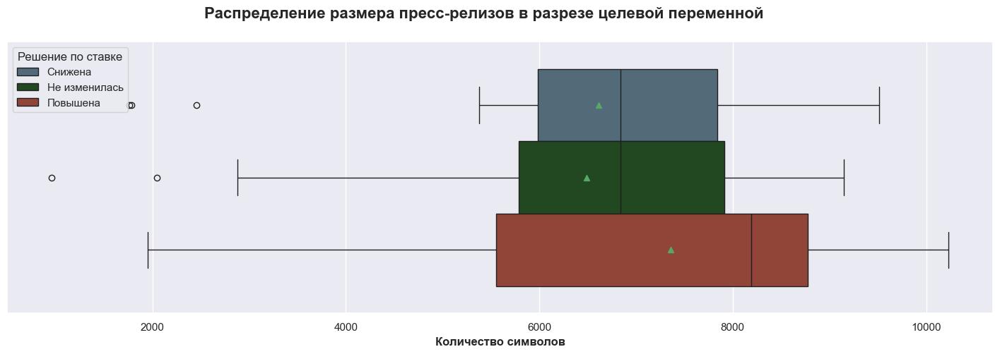
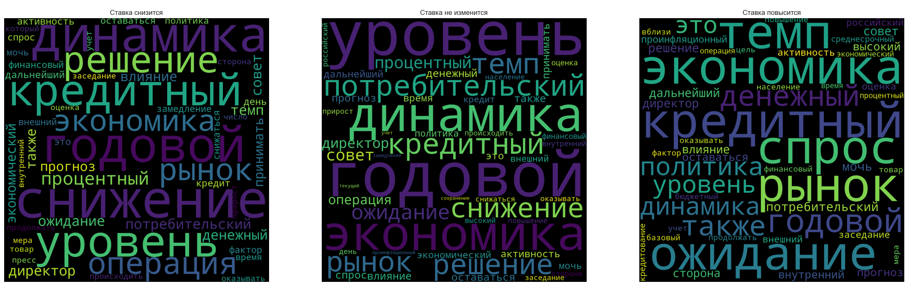
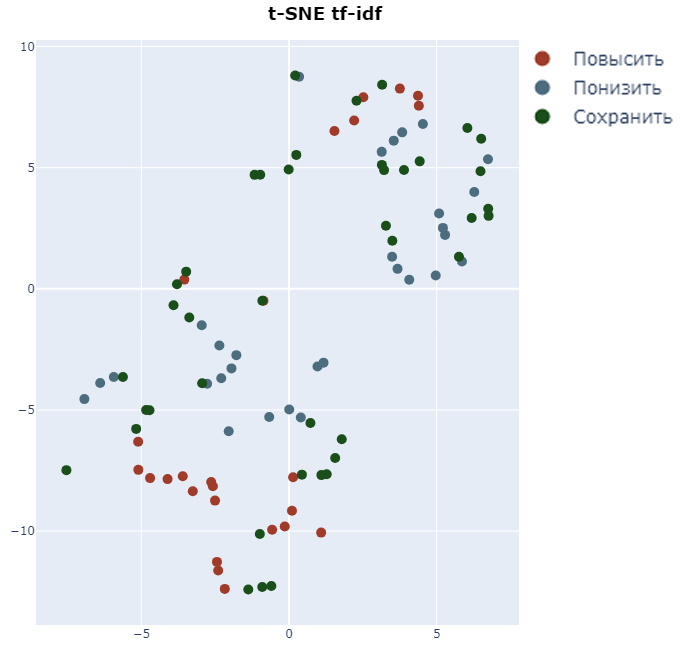
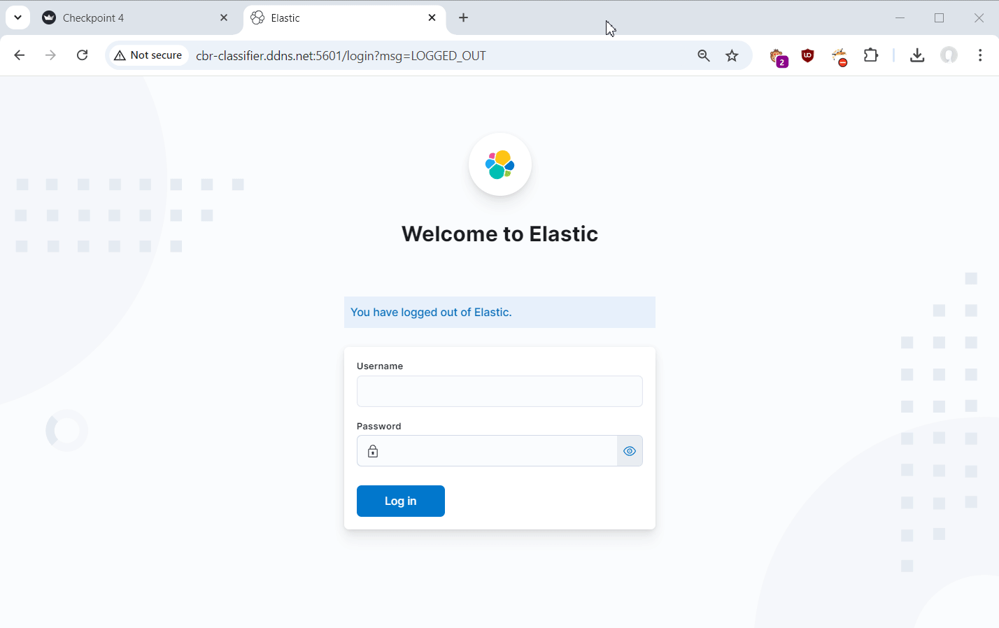

<!-- theme: default -->
<!-- paginate: true -->
<!-- lang: ru -->

# Команда 15

## Классификатор пресс-релизов ЦБ с предсказанием будущей ключевой ставки

**Куратор проекта**: Ковалева Александра

**Участники проекта**:

<table>
    <tr>
        <td>Жарковский Дмитрий</td>
        <td>Кузьмин Дмитрий</td>
    </tr>
    <tr>
        <td>Иванов Иван</td>
        <td>Хадиев Руслан</td>
    </tr>
    <tr>
        <td>Куимов Владислав</td>
        <td></td>
    </tr>
</table>

    
    <a href="https://github.com/ai24-team-15">https://github.com/ai24-team-15</a>

---

# Постановка задачи

ЦБ каждый раз после заседания по ключевой ставке на сайте публикует пресс-релизы, в которых рассказывается про состояние экономики, инфляцию, спрос на продукты, услуги и т.д. и объясняет причину изменения/не изменения ставки.

Задача состоит в том, чтобы по семантике текста понять, что будет происходить с ключевой ставкой после на следующем заседании: ЦБ ее поднимет, опустит или оставит неизменной. Необходимо создать классификатор, который сможет определить тексты на 3 класса: -1 (ставка опустится), 0 (останется неизменной), 1 (ставку повысят).

---

# Цели по проекту на год

- ✅ Парсинг пресс-релизов с сайта ЦБ.
- ✅ Парсинг дополнительных данных: уровень инфляции и курс доллара США.
- ✅ Очистка и предобработка данных.
- ✅ Исследовательский анализ собранных данных и визуализации.
- ✅ Построение бейзлайна на тесктовых данных.
- ✅ Улучшение бейзлайна (классический ML).
- ✅ Обучение и выбор моделей с учетом дополнительных данных об уровне инфляции и курсе доллара США.

---

# Цели по проекту на год

- ✅ Создание API-сервиса и веб-приложения для демонстрации работы классификатора.
- ✅ Создание Docker образов для всех компонентов проекта и запуск приложения через Docker Compose.
- ⬜ Подготовка дополнительных эмбеддингов текстовых наблюдений (Word2Vec, FastText и т.п.).
- ⬜ Проектирование и обучение нейросетевых моделей, используя полученные ранее эмбединги и табличные данные.
- ⬜ Дообучение языковых моделей (например, BERT) на наших данных.

---

# Описание данных

Собранный датасет имеет следующую структуру:

- `date` - дата опубликования пресс-релиза;
- `link` - ссылка на пресс-релиз;
- `title` - заголовок пресс-релиза;
- `release` - текст пресс-релиза;
- `days_between` - количество дней прошедших до следующего релиза;
- `rate` - ключевая ставка утвержденная во время следующего заседания;
- `inflation` - значение инфляции в месяц следующего заседания (годовая);
- `usd` - курс доллара на день следующего заседания;
- `usd_cur_change_relative` - изменение курса доллара в день следующего заседания относительно дня текущего;
- `target_categorial` - изменение ключевой ставки на следующем заседании (-1 - уменьшена, 0 - без изменений, 1 - увеличена);
- `target_absolute` - абсолютное изменение ключевой ставки на следующем заседании (в процентах);
- `target_relative` - относительное изменение ключевой ставки утвержденной на следующем к ключевой ставке утвержденной на текущем заседании.

---

# Особенности данных

- Датасет менее 100 наблюдений. Имеет место проблема переобучения.
- Наблюдается корреляция между ключевой ставкой, инфляцией и курсом доллара.
- Наблюдается дисбаланс по классам:
    - 43,2% наблюдений - о сохранении текущего уровня ставки,
    - 31,6% - о понижении
    - 25,3% - о повышении.

---

# EDA

За длинными пресс-релизами(по количесву символов) как правило следует повышение ключевой ставки.

---

# EDA

Облака слов показывают различие частотности слов в различных классах.

    

---

# EDA

t-SNE: пресс-релизы можно разделить на две группы до весны 2018 и после.

    

---

# Выбор метрик качества

Метрикой качества для сравнения моделей была выбрана ROC AUC OvO, поскольку она является интегральной (не зависит от порога перевода вероятностей в классы), а также не чувствительна к дисбалансу классов (в нашем датасете наблюдается небольшой дисбаланс).

---

# Описание бейзлайн-моделей и полученных метрик

**Бейзлайн**: направление изменения ставки будем предсказывать таким, как в последнем решении.

Данная модель имеет качество **0.749583** по метрике ROC AUC OvO.

---

# Улучшение бейзлайна

**Векторизация текстов:** BoW, Tf-Idf, n-граммы, Word2Vec, Glove.

**Модель классификации:** Логистическая регрессия, Метод опорных векторов, Naive Bayes.

**Лучшие модели:** Tf-Idf + SVM, Tf-Idf + Логистическая регрессия. Стоп слова определены с помощью логистической регрессии с L1-регуляризацией.

---

# Метрики качества моделей

<table border="1" class="dataframe">
  <thead>
    <tr>
      <th>Модель</th>
      <th>Гиперпараметры</th>
      <th>ROC AUC OvO</th>
    </tr>
  </thead>
  <tbody>
    <tr>
      <th>Минимальный бейзлайн</th>
      <td>-</td>
      <td>0.749583</td>
    </tr>
    <tr>
      <th>BoW (тексты релизов) + LogReg с L1-регуляризацией</th>
      <td>C=7.241655172413794, penalty='l1', solver='liblinear'</td>
      <td>0.770722</td>
    </tr>
    <tr>
      <th>BoW + LogReg с L1-, L2-регуляризацией</th>
      <td rowspan="3">C=10, l1_ratio=0.1, max_iter=10000, penalty='elasticnet', solver='saga'</td>
      <td>0.873204</td>
    </tr>
    <tr>
      <th>BoW (тексты релизов + заголовки) + LogReg</th>
      <td>0.871488</td>
    </tr>
    <tr>
      <th>BoW (тексты релизов + числовые переменные) + LogReg</th>
      <td>0.863797</td>
    </tr>
    <tr>
      <th>BoW (тексты релизов) + SVM</th>
      <td>C=7, kernel='linear', probability=True</td>
      <td>0.837417</td>
    </tr>
    <tr>
      <th>TF-IDF (тексты релизов) + LogReg с L1-регуляризацией</th>
      <td>C=10.0, penalty='l1', solver='liblinear'</td>
      <td>0.787614</td>
    </tr>
    <tr>
      <th>TF-IDF (тексты релизов c доп. фильтрацией) + LogReg</th>
      <td rowspan="3">C=10, l1_ratio=0.1, max_iter=10000, penalty='elasticnet', solver='saga'</td>
      <td>0.903270</td>
    </tr>
    <tr>
      <th>TF-IDF (тексты релизов + заголовки) + LogReg</th>
      <td>0.881341</td>
    </tr>
    <tr>
      <th>TF-IDF (тексты релизов + числовые переменные) + LogReg</th>
      <td>0.837195</td>
    </tr>
    <tr class="yellow">
      <th>TF-IDF (тексты релизов) + SVM</th>
      <td>C=10, kernel='linear', probability=True</td>
      <td>0.927695</td>
    </tr>
    <tr>
      <th>N-граммы плюс Naive Bayes</th>
      <td>ngram_range(3, 6)</td>
      <td>0.777142</td>
    </tr>
    <tr>
      <th>Word2Vec + LogReg</th>
      <td>C=1, l1_ratio=0.9, max_iter=10000, penalty='elasticnet', solver='saga'</td>
      <td>0.732520</td>
    </tr>
    <tr>
      <th>Word2Vec (предобученная модель) + LogReg</th>
      <td>C=0.1, l1_ratio=0.1, max_iter=10000, penalty='elasticnet', solver='saga'</td>
      <td>0.765176</td>
    </tr>
    <tr>
      <th>Word2Vec (предобученная модель с фильтрацией) + LogReg</th>
      <td>C=10, l1_ratio=0.5, max_iter=10000, penalty='elasticnet', solver='saga'</td>
      <td>0.697273</td>
    </tr>
    <tr>
      <th>Word2Vec (предобученная модель) + SVM</th>
      <td>C=7, kernel='linear', probability=True</td>
      <td>0.749317</td>
    </tr>
    <tr>
      <th>GloVe + SVM</th>
      <td>C=3, probability=True</td>
      <td>0.768338</td>
    </tr>
  </tbody>
</table>

---

# Сервис FastAPI

Реализован сервис на FastAPI для управления моделями и данными.

**Данные:** Загрузка данных с помощью post-запроса или с S3 сервера. При остановке сервиса данные сохраняются и загружаются при последующем запуске.

**Обучение моделей:** Обучение производится с заданными в запросе гиперпараметрами, в отдельном процессе. Реализованы две модели, показавшие лучшие результаты на предыдущем чекпоинте.

**Инференс моделей:** Реализован как обычный прогноз, так и вычисление метрик при обучении на части данных.

**Управление моделями:** Как и данные, модели сохраняются во время остановки сервиса и загружаются при запуске.

---

# Приложение Streamlit

Реализован многостраничный пользовательский-интерфейс для взаимодействия с сервисом.

**Загрузка данных:** Загрузка своих данных, либо выбрать актуальные данные.

**Исследовательский анализ:** Баланс классов, динамика ставки, курса доллара США и годовой инфляции, длина текстов, облака слов, t-SNE визуализация.

**Машинное обучение:** Обучение моделей с выбором гиперпараметров, сравнение моделей между собой и предсказание с помощью выбранной модели.

---

# Инфраструктура

- Docker-образы сервиса и веб-приложения.
- Конфигурация Docker Compose для запуска приложения.
- Система сбора логов ELK.
- Деплой в Yandex Cloud с использованием сервисов:
    - Object Storage
    - Container Registry
    - Compute Cloud
    
Приложение доступно по адресу http://cbr-classifier.ddns.net/

---

#### Демонстрация работы сервиса

---

#### Демонстрация системы сбора логов

---

# Распределение работы в команде

TODO: добавляйтесь)

- **Куимов Владислав**: часть скрапера, немного EDA (t-SNE), некоторые модели (c GloVe), инфраструктура (Docker, ELK, деплой в Yandex Cloud)
- **Жарковский Дмитрий**: часть скрапера, часть исследователького анализа, модели с Bow, Tf-Idf и Word2Vec, Streamlit в последнем чекпоинте.
- **Кузьмин Дмитрий**: часть скрапера, сервис FastAPI.
- **Хадиев Руслан**: участие в обсуждениях по возможным путям реализации проекта. Подготовка выводов по моделям и результатам реализации проекта. 

---

# Цели по проекту на второе полугодие

- Подготовка дополнительных эмбеддингов текстовых наблюдений (Word2Vec, FastText и т.п.).
- Проектирование и обучение нейросетевых моделей, используя полученные ранее эмбединги и табличные данные.
- Дообучение языковых моделей (например, BERT) на наших данных.

#### Дополнительно:

- Ансамблирование моделей.
- Предсказание, на сколько процентных пунктов изменится ставка.
- Аугментация данных.

---

# Итоги

- Собран исходный датасет и проведен подробный исследовательский анализ.
- Подобрана модель, показавшую достаточно высокое качество по выбранной метрике.
- Разработаны и развернуты сервис и веб-приложение, позволяющие исследовать исходный датасет, обучать, применять и сравнивать модели.
